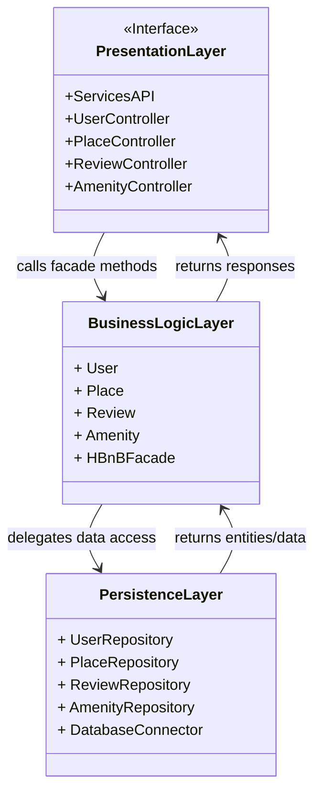
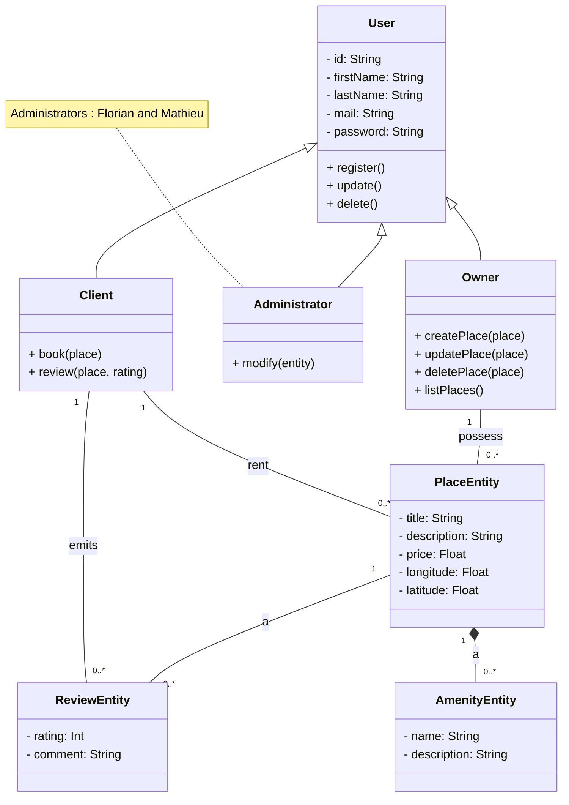
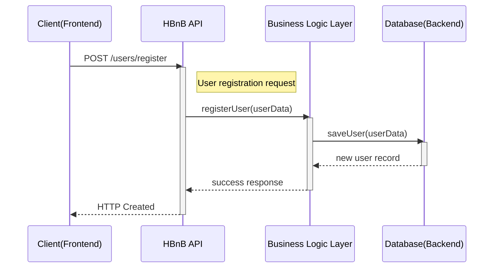
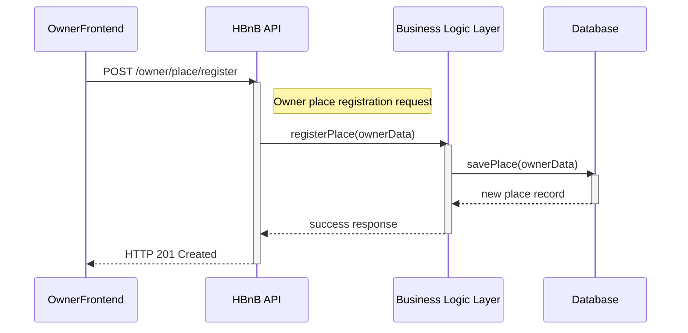
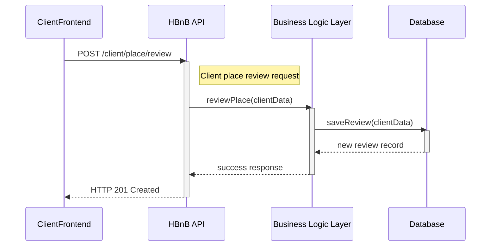
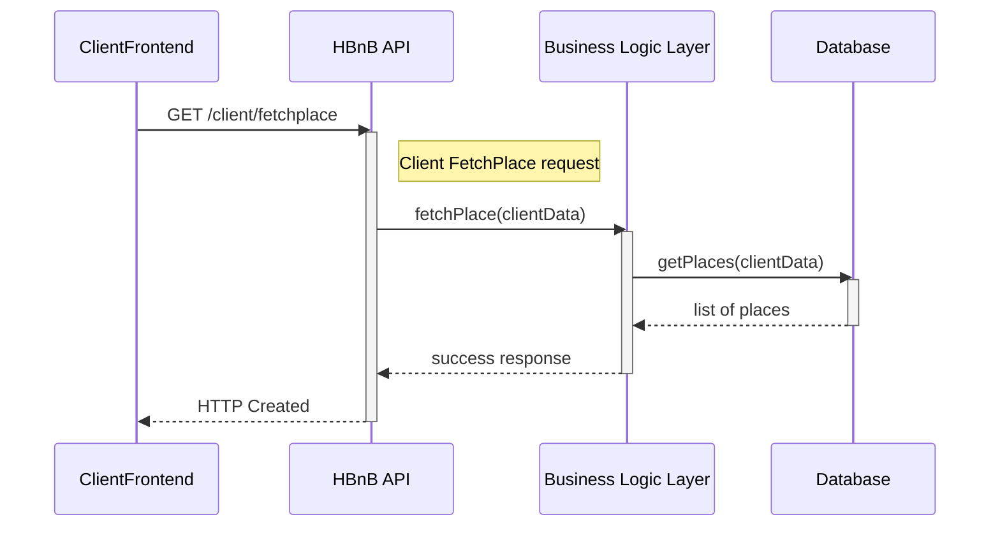

# 1. HBnB Application Architecture

This diagram outlines the **high-level, layered architecture** of the HBnB application.
The system is separated into three distinct layers to ensure a **clean separation of concerns** and facilitate maintainability:

##  📊​High-Level Package Diagram Description

- **Presentation Layer**
  - Exposes RESTful API endpoints to external clients (web, mobile).
  - Controllers such as `UserController`, `PlaceController`, `ReviewController`, and `AmenityController` handle incoming HTTP requests.
  - These controllers **do not implement business logic** directly; instead, they delegate all domain-related operations to the Business Logic Layer.

- **Business Logic Layer**
  - Represents the **core domain** of the application.
  - Models such as `User`, `Place`, `Review`, and `Amenity` capture the main business entities.
  - The `HBnBFacade` acts as a **single entry point**, providing a simplified interface for the Presentation Layer.
  - It ensures that controllers interact with the system in a **consistent and controlled** manner.
  - The facade delegates data access tasks to the Persistence Layer but enforces **business rules** before doing so (e.g., validating a reservation date, ensuring a user is authenticated).

- **Persistence Layer**
  - Responsible for **data storage and retrieval**.
  - Uses repositories (e.g., `UserRepository`, `PlaceRepository`) to abstract raw database queries.
  - `DatabaseConnector` ensures a single, consistent way to connect and manage the database.
  - This design isolates the Business Logic from the database technology, making it easier to replace or modify the underlying DB without impacting the rest of the system.

### Interactions between Layers

1. **Request Handling (Top-Down)**
   - A client (e.g., mobile app) sends a request → handled by the **Presentation Layer** controller.
   - The controller forwards the request to the **Business Logic Layer** through the `HBnBFacade`.

2. **Business Processing**
   - The **Business Logic Layer** validates inputs and applies business rules.
   - Example: When creating a booking, the system checks that the selected dates are available.
   - If everything is valid, the business layer prepares a request for persistence.

3. **Data Access**
   - The Business Logic Layer calls the **Persistence Layer** to save or retrieve information.
   - Example: `PlaceRepository.findByCity("Paris")` or `UserRepository.save(newUser)`.

4. **Response Flow (Bottom-Up)**
   - The Persistence Layer returns data to the Business Logic Layer.
   - The Business Logic Layer transforms raw data into meaningful domain objects and applies additional processing.
   - The Presentation Layer then formats the response (usually as JSON) and returns it to the client.

This **request–response cycle** ensures that:
- The Presentation Layer remains focused only on handling input/output.
- The Business Logic Layer contains all application rules.
- The Persistence Layer is responsible for efficient and reliable data management.

### Diagram: Package Architecture

## 📊​Detailled Class Diagram for Business Logic Layer

## 2. Business Logic Class Diagram

The following diagram presents the **core business model** of the HBnB application.
It defines the main **entities**, their **attributes**, and their **relationships**, as well as the different **user roles** that interact with the system.

### Main Concepts

- **User (abstract)**
  - Represents a general user of the platform.
  - Contains shared attributes such as `id`, `firstName`, `lastName`, `mail`, and `password`.
  - Provides common operations: `register()`, `update()`, and `delete()`.
  - Specialized into three roles:
    - **Client**: a user who can book places and leave reviews.
    - **Owner**: a user who can create and manage places.
    - **Administrator**: a user with privileges to modify system entities.
      - *Note: In this project, administrators are represented by Florian and Mathieu.*

- **Client**
  - Extends `User`.
  - Main responsibilities:
    - `book(place)` → allows a client to rent a place.
    - `review(place, rating)` → enables a client to leave feedback on a place.

- **Owner**
  - Extends `User`.
  - Main responsibilities:
    - `createPlace(place)`, `updatePlace(place)`, `deletePlace(place)`.
    - `listPlaces()` → view all owned properties.

- **Administrator**
  - Extends `User`.
  - Has the ability to `modify(entity)` → applies administrative changes across the system.

- **PlaceEntity**
  - Represents a rental property.
  - Attributes: `title`, `description`, `price`, `longitude`, `latitude`.
  - A place can have multiple `AmenityEntity` objects (composition).
  - A place can also receive multiple `ReviewEntity` objects (association).

- **AmenityEntity**
  - Represents a feature or facility offered with a place (e.g., Wi-Fi, parking).
  - Attributes: `name`, `description`.

- **ReviewEntity**
  - Represents client feedback on a place.
  - Attributes: `rating` (numeric score) and `comment`.
  - Linked to both the `Client` (who wrote it) and the `PlaceEntity` (being reviewed).

### Relationships

1. **Inheritance**
   - `User` is a generalization of `Client`, `Owner`, and `Administrator`.
   - This ensures a clear separation of roles while keeping shared attributes and methods centralized.

2. **Associations**
   - A `Client` can rent multiple `PlaceEntity` objects.
   - A `Client` can emit multiple `ReviewEntity` objects.
   - An `Owner` possesses one or more `PlaceEntity` objects.

3. **Composition and Aggregation**
   - A `PlaceEntity` is composed of multiple `AmenityEntity` objects (if the place is deleted, its amenities are deleted as well).
   - A `PlaceEntity` is associated with multiple `ReviewEntity` objects (reviews can exist independently, but are tied to places).

This structure reflects the **domain rules** of the HBnB platform:
- Users take on different roles with distinct responsibilities.
- Places and amenities represent the core offerings of the platform.
- Reviews enable clients to provide feedback, reinforcing trust in the system.

### Diagram: Business Logic Layer

## Sequence Diagrams for API Calls

### User Registration

This sequence diagram illustrates the **process of creating a new user account** in the HBnB system.
It shows how the **frontend client**, **API layer**, **Business Logic Layer (BL)**, and **database** interact to successfully register a new user.

1. **Client → API**
   - The client (frontend) initiates the registration by sending an HTTP `POST /users/register` request with the necessary user data (e.g., first name, last name, email, password).
   - The API receives the request and validates its format.

2. **API → Business Logic Layer**
   - The API forwards the request to the **Business Logic Layer** via the method `registerUser(userData)`.
   - At this stage, the BL applies validation rules (e.g., check if email already exists, verify password strength).

3. **Business Logic Layer → Database**
   - If the data is valid, the BL interacts with the **Persistence Layer** to save the new user.
   - The user information is stored in the database through a `saveUser(userData)` operation.

4. **Database → Business Logic Layer**
   - The database confirms the creation of the new record and returns the stored user data.

5. **Business Logic Layer → API**
   - The BL processes the result and prepares a success response indicating that the registration was successful.

6. **API → Client**
   - The API sends back an HTTP `201 Created` response to the client, confirming that the account was created.

### Diagram: User Registration

### Place Creation

This sequence diagram illustrates the **process of creating a new place listing** in the HBnB system.
It shows how an **Owner**, the **API layer**, the **Business Logic Layer (BL)**, and the **Database** interact to successfully register a new place.

1. **Owner → API**
   - The owner (frontend) sends an HTTP `POST /owner/place/register` request with the new place data (title, description, price, location, amenities).
   - The API receives the request and validates its format.

2. **API → Business Logic Layer**
   - The API forwards the request to the BL via `registerPlace(ownerData)`.
   - The BL applies validation rules (e.g., title not empty, price > 0).

3. **Business Logic Layer → Database**
   - If validation passes, the BL calls the Persistence Layer to save the new place using `savePlace(ownerData)`.

4. **Database → Business Logic Layer**
   - The database confirms creation and returns the saved record.

5. **Business Logic Layer → API**
   - The BL processes the result and prepares a success response.

6. **API → Owner**
   - The API responds with `HTTP 201 Created` to the client, confirming the place was registered.

### Diagram: Place Creation

### Review Submission

This sequence diagram illustrates the **process of submitting a review** for a place in the HBnB system.
It shows how a **Client**, the **API layer**, the **Business Logic Layer (BL)**, and the **Database** interact to store a new review.

1. **Client → API**
   - The client sends an HTTP `POST /client/place/review` request with review data (place ID, rating, comment).
   - The API receives the request and validates the input.

2. **API → Business Logic Layer**
   - The API forwards the request to the BL via `reviewPlace(clientData)`.
   - The BL enforces business rules, such as verifying that the client has booked the place before reviewing it and that the rating is within valid bounds.

3. **Business Logic Layer → Database**
   - Once validation passes, the BL calls the Persistence Layer to save the review using `saveReview(clientData)`.

4. **Database → Business Logic Layer**
   - The database confirms the creation of the review record and returns it to the BL.

5. **Business Logic Layer → API**
   - The BL processes the result and prepares a success response.

6. **API → Client**
   - The API sends an HTTP `201 Created` response back to the client, confirming that the review has been successfully submitted.

### Diagram: Review Submission

### Fetching a list of places

This sequence diagram illustrates the **process of fetching a list of places** based on user-specified criteria (e.g., city, price range, amenities).
It shows how a **Client**, the **API layer**, the **Business Logic Layer (BL)**, and the **Database** interact to retrieve the requested data.

1. **Client → API**
   - The client sends an HTTP `GET /client/fetchplace` request with query parameters (location, dates, price range, etc.).
   - The API receives the request and validates the parameters.

2. **API → Business Logic Layer**
   - The API forwards the request to the BL via `fetchPlace(clientData)`.
   - The BL applies business rules, such as filtering by availability, location, and price.

3. **Business Logic Layer → Database**
   - The BL queries the Persistence Layer to fetch the places matching the criteria.
   - This is done through a method like `getPlaces(clientData)`.

4. **Database → Business Logic Layer**
   - The database returns the list of matching places to the BL.

5. **Business Logic Layer → API**
   - The BL processes the results (e.g., applying additional filters or formatting) and prepares a success response.

6. **API → Client**
   - The API sends an HTTP `200 OK` response with the list of places back to the client.

### Diagram: Fetching a List of Places

