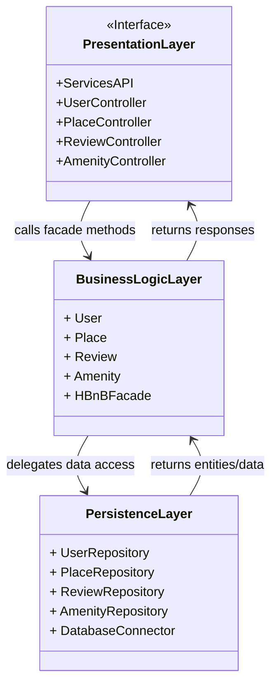

# 1. HBnB Application Architecture

This diagram outlines the **high-level, layered architecture** of the HBnB application.
The system is separated into three distinct layers to ensure a **clean separation of concerns** and facilitate maintainability:

## High-Lvel Package Diagram Description

- **Presentation Layer**
  - Exposes RESTful API endpoints to external clients (web, mobile).
  - Controllers such as `UserController`, `PlaceController`, `ReviewController`, and `AmenityController` handle incoming HTTP requests.
  - These controllers **do not implement business logic** directly; instead, they delegate all domain-related operations to the Business Logic Layer.

- **Business Logic Layer**
  - Represents the **core domain** of the application.
  - Models such as `User`, `Place`, `Review`, and `Amenity` capture the main business entities.
  - The `HBnBFacade` acts as a **single entry point**, providing a simplified interface for the Presentation Layer.
  - It ensures that controllers interact with the system in a **consistent and controlled** manner.
  - The facade delegates data access tasks to the Persistence Layer but enforces **business rules** before doing so (e.g., validating a reservation date, ensuring a user is authenticated).

- **Persistence Layer**
  - Responsible for **data storage and retrieval**.
  - Uses repositories (e.g., `UserRepository`, `PlaceRepository`) to abstract raw database queries.
  - `DatabaseConnector` ensures a single, consistent way to connect and manage the database.
  - This design isolates the Business Logic from the database technology, making it easier to replace or modify the underlying DB without impacting the rest of the system.

### Interactions between Layers

1. **Request Handling (Top-Down)**
   - A client (e.g., mobile app) sends a request → handled by the **Presentation Layer** controller.
   - The controller forwards the request to the **Business Logic Layer** through the `HBnBFacade`.

2. **Business Processing**
   - The **Business Logic Layer** validates inputs and applies business rules.
   - Example: When creating a booking, the system checks that the selected dates are available.
   - If everything is valid, the business layer prepares a request for persistence.

3. **Data Access**
   - The Business Logic Layer calls the **Persistence Layer** to save or retrieve information.
   - Example: `PlaceRepository.findByCity("Paris")` or `UserRepository.save(newUser)`.

4. **Response Flow (Bottom-Up)**
   - The Persistence Layer returns data to the Business Logic Layer.
   - The Business Logic Layer transforms raw data into meaningful domain objects and applies additional processing.
   - The Presentation Layer then formats the response (usually as JSON) and returns it to the client.

This **request–response cycle** ensures that:
- The Presentation Layer remains focused only on handling input/output.
- The Business Logic Layer contains all application rules.
- The Persistence Layer is responsible for efficient and reliable data management.

### Diagram: Package Architecture

