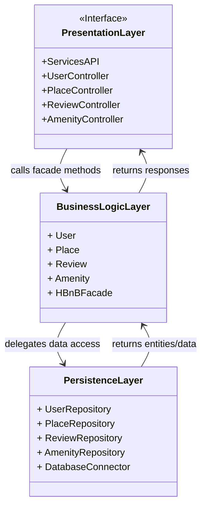

<p align="center">

</p>

# 1. HBnB Application Architecture

This diagram outlines the **high-level, layered architecture** of the HBnB application.
The system is separated into three distinct layers to ensure a **clean separation of concerns** and facilitate maintainability:

##  📊​High-Level Package Diagram Description

- **Presentation Layer**
  - Exposes RESTful API endpoints to external clients (web, mobile).
  - Controllers such as `UserController`, `PlaceController`, `ReviewController`, and `AmenityController` handle incoming HTTP requests.
  - These controllers **do not implement business logic** directly; instead, they delegate all domain-related operations to the Business Logic Layer.

- **Business Logic Layer**
  - Represents the **core domain** of the application.
  - Models such as `User`, `Place`, `Review`, and `Amenity` capture the main business entities.
  - The `HBnBFacade` acts as a **single entry point**, providing a simplified interface for the Presentation Layer.
  - It ensures that controllers interact with the system in a **consistent and controlled** manner.
  - The facade delegates data access tasks to the Persistence Layer but enforces **business rules** before doing so (e.g., validating a reservation date, ensuring a user is authenticated).

- **Persistence Layer**
  - Responsible for **data storage and retrieval**.
  - Uses repositories (e.g., `UserRepository`, `PlaceRepository`) to abstract raw database queries.
  - `DatabaseConnector` ensures a single, consistent way to connect and manage the database.
  - This design isolates the Business Logic from the database technology, making it easier to replace or modify the underlying DB without impacting the rest of the system.

### Interactions between Layers

1. **Request Handling (Top-Down)**
   - A client (e.g., mobile app) sends a request → handled by the **Presentation Layer** controller.
   - The controller forwards the request to the **Business Logic Layer** through the `HBnBFacade`.

2. **Business Processing**
   - The **Business Logic Layer** validates inputs and applies business rules.
   - Example: When creating a booking, the system checks that the selected dates are available.
   - If everything is valid, the business layer prepares a request for persistence.

3. **Data Access**
   - The Business Logic Layer calls the **Persistence Layer** to save or retrieve information.
   - Example: `PlaceRepository.findByCity("Paris")` or `UserRepository.save(newUser)`.

4. **Response Flow (Bottom-Up)**
   - The Persistence Layer returns data to the Business Logic Layer.
   - The Business Logic Layer transforms raw data into meaningful domain objects and applies additional processing.
   - The Presentation Layer then formats the response (usually as JSON) and returns it to the client.

This **request–response cycle** ensures that:
- The Presentation Layer remains focused only on handling input/output.
- The Business Logic Layer contains all application rules.
- The Persistence Layer is responsible for efficient and reliable data management.

### Diagram: Package Architecture



## 📊​Detailled Class Diagram for Business Logic Layer

## 2. Business Logic Class Diagram

The following diagram presents the **core business model** of the HBnB application.
It defines the main **entities**, their **attributes**, and their **relationships**, as well as the different **user roles** that interact with the system.

### Main Concepts

- **User (abstract)**
  - Represents a general user of the platform.
  - Contains shared attributes such as `id`, `firstName`, `lastName`, `mail`, and `password`.
  - Provides common operations: `register()`, `update()`, and `delete()`.
  - Specialized into three roles:
    - **Client**: a user who can book places and leave reviews.
    - **Owner**: a user who can create and manage places.
    - **Administrator**: a user with privileges to modify system entities.
      - *Note: In this project, administrators are represented by Florian and Mathieu.*

- **Client**
  - Extends `User`.
  - Main responsibilities:
    - `book(place)` → allows a client to rent a place.
    - `review(place, rating)` → enables a client to leave feedback on a place.

- **Owner**
  - Extends `User`.
  - Main responsibilities:
    - `createPlace(place)`, `updatePlace(place)`, `deletePlace(place)`.
    - `listPlaces()` → view all owned properties.

- **Administrator**
  - Extends `User`.
  - Has the ability to `modify(entity)` → applies administrative changes across the system.

- **PlaceEntity**
  - Represents a rental property.
  - Attributes: `title`, `description`, `price`, `longitude`, `latitude`.
  - A place can have multiple `AmenityEntity` objects (composition).
  - A place can also receive multiple `ReviewEntity` objects (association).

- **AmenityEntity**
  - Represents a feature or facility offered with a place (e.g., Wi-Fi, parking).
  - Attributes: `name`, `description`.

- **ReviewEntity**
  - Represents client feedback on a place.
  - Attributes: `rating` (numeric score) and `comment`.
  - Linked to both the `Client` (who wrote it) and the `PlaceEntity` (being reviewed).

### Relationships

1. **Inheritance**
   - `User` is a generalization of `Client`, `Owner`, and `Administrator`.
   - This ensures a clear separation of roles while keeping shared attributes and methods centralized.

2. **Associations**
   - A `Client` can rent multiple `PlaceEntity` objects.
   - A `Client` can emit multiple `ReviewEntity` objects.
   - An `Owner` possesses one or more `PlaceEntity` objects.

3. **Composition and Aggregation**
   - A `PlaceEntity` is composed of multiple `AmenityEntity` objects (if the place is deleted, its amenities are deleted as well).
   - A `PlaceEntity` is associated with multiple `ReviewEntity` objects (reviews can exist independently, but are tied to places).

This structure reflects the **domain rules** of the HBnB platform:
- Users take on different roles with distinct responsibilities.
- Places and amenities represent the core offerings of the platform.
- Reviews enable clients to provide feedback, reinforcing trust in the system.

### Diagram: Business Logic Layer

```mermaid
classDiagram
    direction TD

    User <|-- Client
    User <|-- Administrator
    User <|-- Owner

    class User{
        - id: String
        - firstName: String
        - lastName: String
        - mail: String
        - password: String
        + register()
        + update()
        + delete()
    }

    note for Administrator "Administrators : Florian and Mathieu"

    class Client{
        + book(place)
        + review(place, rating)
    }

    class Administrator{
        + modify(entity)
    }

    class Owner{
        + createPlace(place)
        + updatePlace(place)
        + deletePlace(place)
        + listPlaces()
    }

    Client "1" -- "0..*" ReviewEntity : emits
    Client "1" -- "0..*" PlaceEntity : rent
    Owner "1" -- "0..*" PlaceEntity : possess
    PlaceEntity "1" -- "0..*" ReviewEntity : a

    PlaceEntity "1" *-- "0..*" AmenityEntity : a

    class PlaceEntity{
        - title: String
        - description: String
        - price: Float
        - longitude: Float
        - latitude: Float
    }

    class AmenityEntity{
        - name: String
        - description: String
    }

    class ReviewEntity{
        - rating: Int
        - comment: String
    }

