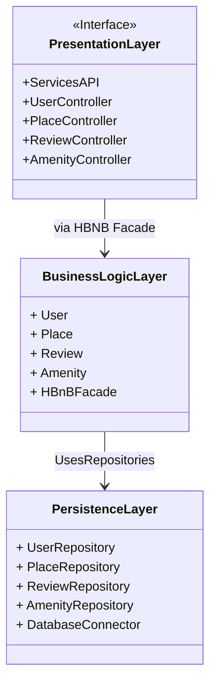
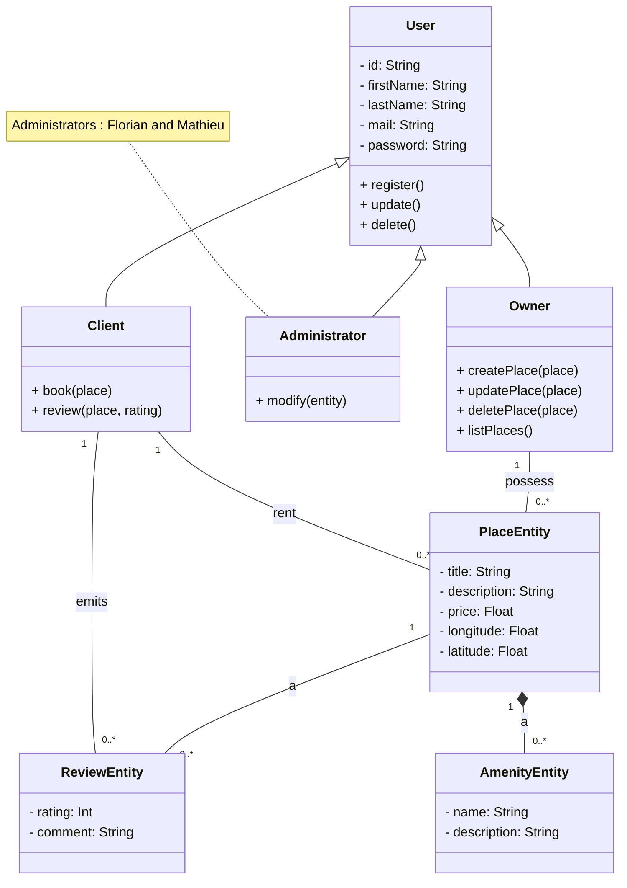
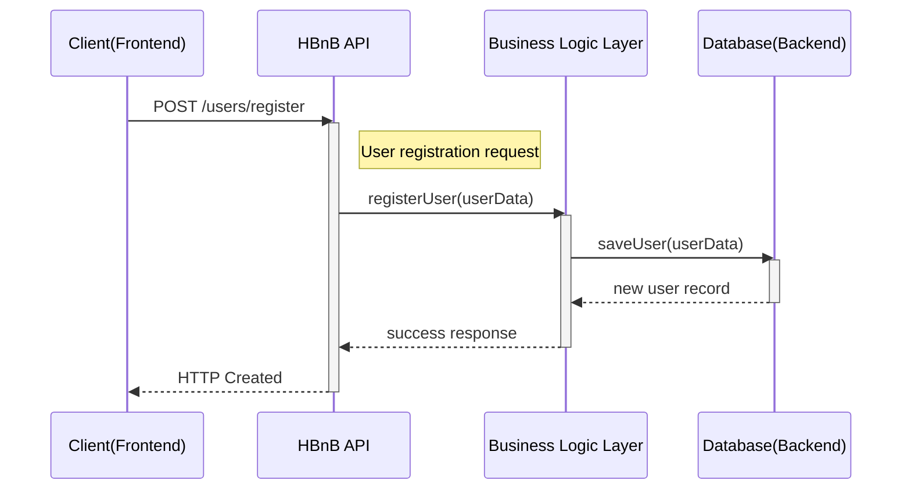
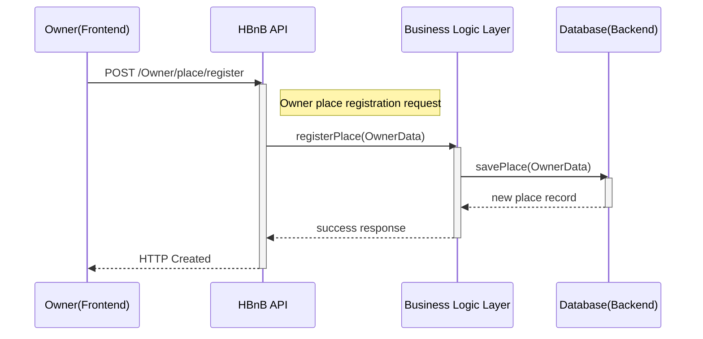
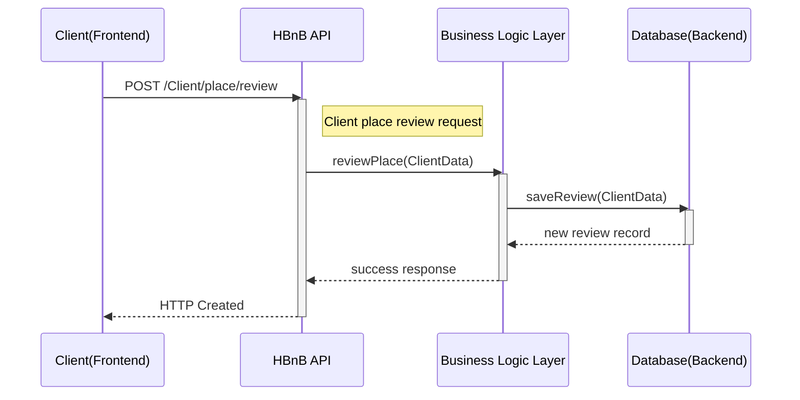
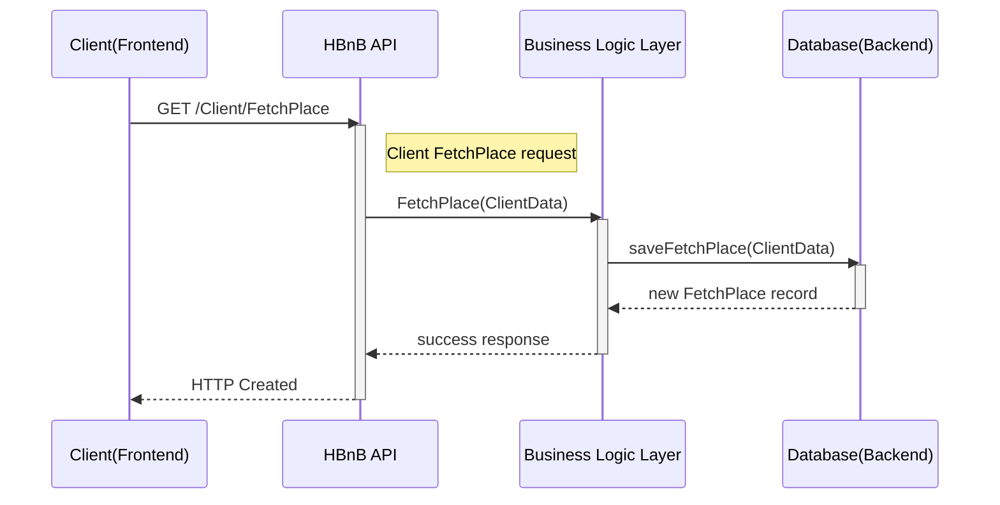

# 📝 Description Part 1
This project, HBnB Evolution, is the initial phase of developing a simplified AirBnB-like application. This part focuses on creating a comprehensive technical documentation blueprint using UML (Unified Modeling Language). The goal is to design the system's architecture and interactions before implementation, ensuring a clear and shared understanding among the team. The application is structured into three main layers: the Presentation Layer, the Business Logic Layer, and the Persistence Layer.

# 📂 Exercise Content
This directory contains the UML diagrams and explanatory notes that form the technical documentation for the project.

[0. High-Level Package Diagram:]() A high-level package diagram illustrating the application's three-layer architecture and the communication between them via the Facade Pattern. This diagram provides an overview of the code's organization.

[1. Detailed Class Diagram for Business Logic Layer:]() A detailed class diagram for the Business Logic layer. It models the core entities of the application (User, Place, Review, Amenity) with their attributes, methods, and relationships. This diagram is crucial for designing the data models.

[2. Sequence Diagrams for API Calls:]() A series of sequence diagrams that illustrate the flow of information and interactions between the different layers for specific use cases, such as user registration, place creation, review submission, and fetching a list of places.

[3. Documentation Compilation:]() The compilation of all diagrams and their explanatory notes into a single, cohesive document. This final document serves as a complete reference for the implementation phase, ensuring the entire development team works from the same architectural vision.

🛠️ Prerequisites
Diagramming Software: Proficiency with a tool like Mermaid.js to create and manage UML diagrams.

UML Knowledge: A basic understanding of UML notation for class, package, and sequence diagrams is required.

# 🚀 Tests
As this project is a documentation and design exercise, there are no tests to run. The expected deliverables are the UML diagrams and the accompanying documentation.

# ✍️ Authors

  
| Author | Role | GitHub | Email |
|--------|------|--------|-------|
| **Florian Hadjar** | Co-Developer | [@Boubouche1709](https://github.com/Boubouche1709) | 10482@holbertonstudents.com |
| **Mathieu Godalier** | Co-developer | [@Mathieu7483](https://github.com/Mathieu7483) | 11436@holbertonstudents.com |

# ⚖️ License
This project is licensed under the MIT License. For more details, see the LICENSE file.
