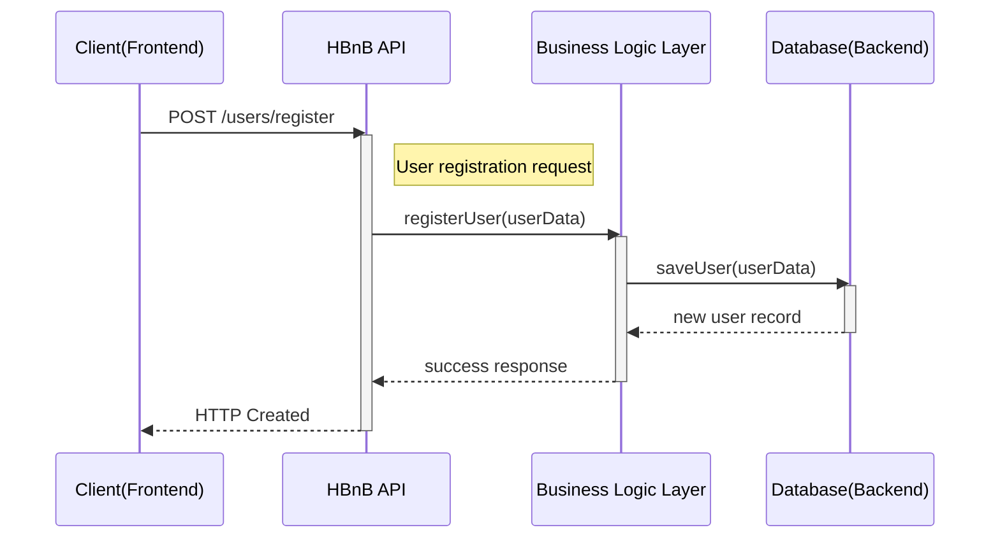
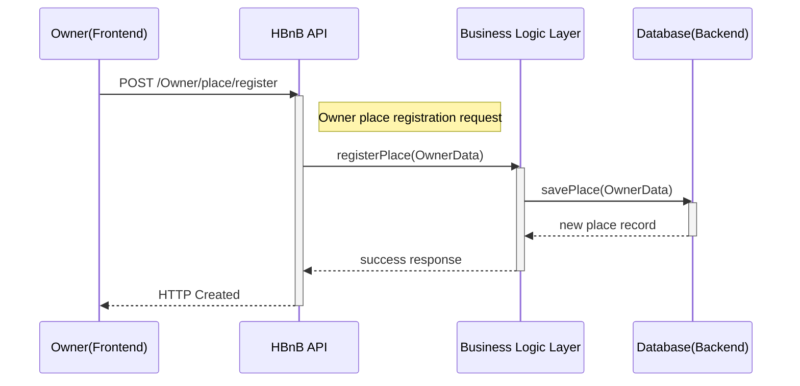
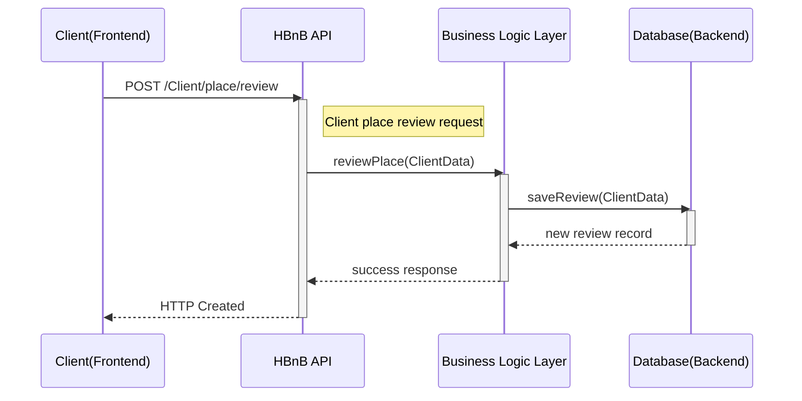
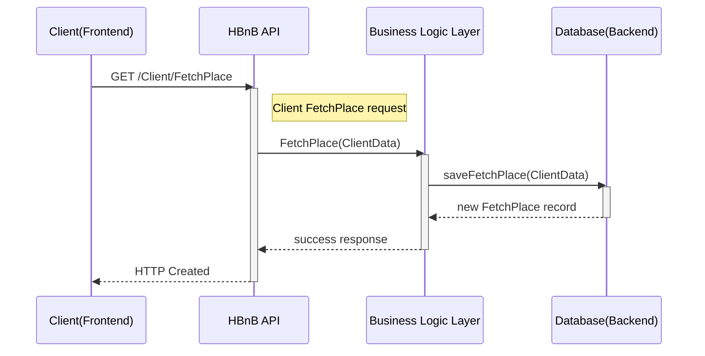

# Sequence Diagrams for API Calls
# 1 - User Registration
description

```mermaid
sequenceDiagram
    participant Client(Frontend)
    participant API as HBnB API
    participant BL as Business Logic Layer
    participant Database(Backend)

    Client(Frontend)->>API: POST /users/register
    activate API
    Note right of API: User registration request

    API->>BL: registerUser(userData)
    activate BL

    BL->>Database(Backend): saveUser(userData)
    activate Database(Backend)

    Database(Backend)-->>BL: new user record
    deactivate Database(Backend)

    BL-->>API: success response
    deactivate BL

    API-->>Client(Frontend): HTTP Created
    deactivate API
```

# 2 - Place Creation
Description

```mermaid
sequenceDiagram
    participant Owner(Frontend)
    participant API as HBnB API
    participant BL as Business Logic Layer
    participant Database(Backend)

    Owner(Frontend)->>API: POST /Owner/place/register
    activate API
    Note right of API: Owner place registration request

    API->>BL: registerPlace(OwnerData)
    activate BL

    BL->>Database(Backend): savePlace(OwnerData)
    activate Database(Backend)

    Database(Backend)-->>BL: new place record
    deactivate Database(Backend)

    BL-->>API: success response
    deactivate BL

    API-->>Owner(Frontend): HTTP Created
    deactivate API
```

# 3 - Review Submission
Descritpion

```mermaid
sequenceDiagram
    participant Client(Frontend)
    participant API as HBnB API
    participant BL as Business Logic Layer
    participant Database(Backend)

    Client(Frontend)->>API: POST /Client/place/review
    activate API
    Note right of API: Client place review request

    API->>BL: reviewPlace(ClientData)
    activate BL

    BL->>Database(Backend): saveReview(ClientData)
    activate Database(Backend)

    Database(Backend)-->>BL: new review record
    deactivate Database(Backend)

    BL-->>API: success response
    deactivate BL

    API-->>Client(Frontend): HTTP Created
    deactivate API
```

# 4 - Fetching a list of places 

```mermaid
sequenceDiagram
    participant Client(Frontend)
    participant API as HBnB API
    participant BL as Business Logic Layer
    participant Database(Backend)

    Client(Frontend)->>API: GET /Client/FetchPlace
    activate API
    Note right of API: Client FetchPlace request

    API->>BL: FetchPlace(ClientData)
    activate BL

    BL->>Database(Backend): saveFetchPlace(ClientData)
    activate Database(Backend)

    Database(Backend)-->>BL: new FetchPlace record
    deactivate Database(Backend)

    BL-->>API: success response
    deactivate BL

    API-->>Client(Frontend): HTTP Created
    deactivate API
```