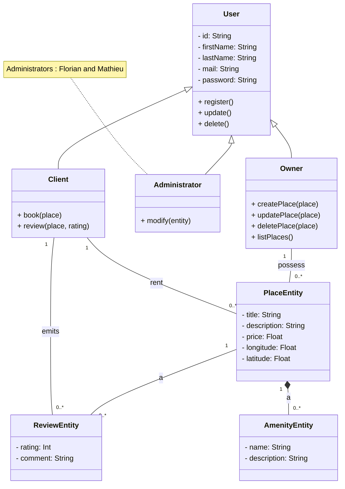

# HBnB Detailed Class Diagram
This diagram provides a detailed view of the core business entities and their relationships within the HBnB application. It illustrates the attributes and methods of each class, focusing on the Business Logic Layer.

The diagram shows:

Inheritance: How specific user types (Client, Owner, Administrator) inherit from the base User class.

Cardinality: The number of objects involved in each relationship (e.g., a Place can have many Reviews).

Composition & Aggregation: The specific nature of relationships, showing how entities are connected (e.g., a Place is composed of Amenities).

This detailed view is crucial for understanding the object-oriented structure of the application and for guiding the development of the core business logic

