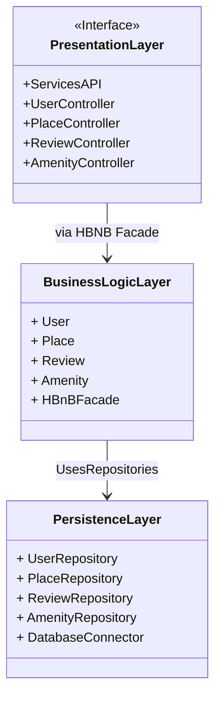

HBnB Application Architecture
This diagram outlines the high-level, layered architecture of the HBnB application. The system is separated into three distinct layers to ensure a clean separation of concerns:

Presentation Layer: This layer serves as the user-facing interface, providing API endpoints and services.

Business Logic Layer: The core of the application, containing the main business logic and models (User, Place, etc.). It acts as a central facade for the other layers.

Persistence Layer: This layer handles all data storage and retrieval operations, abstracting the database from the business logic.

The Presentation Layer communicates with the Business Logic Layer using a Facade Pattern to simplify interactions. The Business Logic Layer then interacts with the Persistence Layer to perform all necessary database operations.

