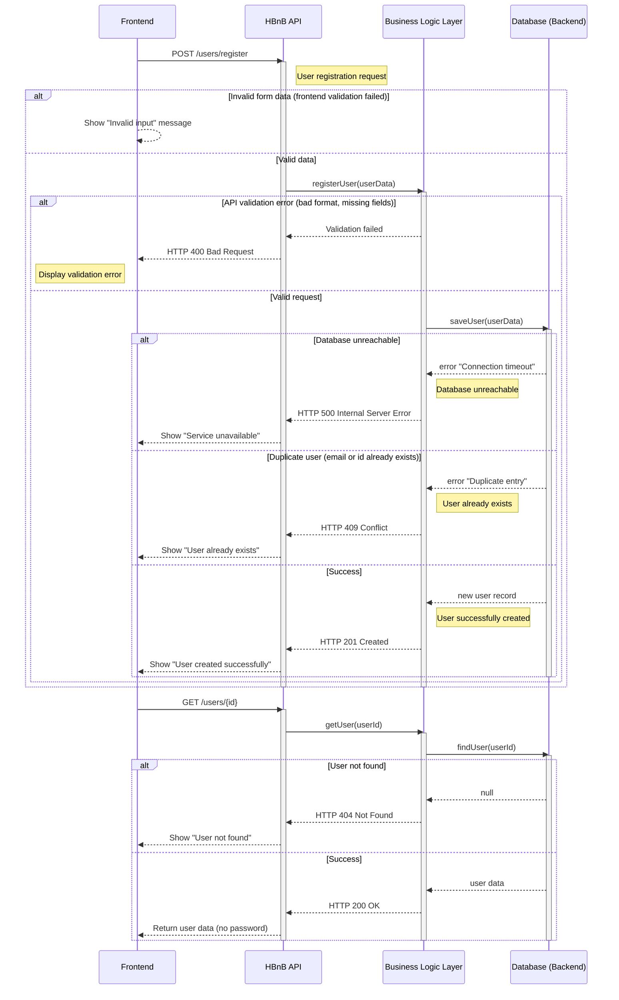
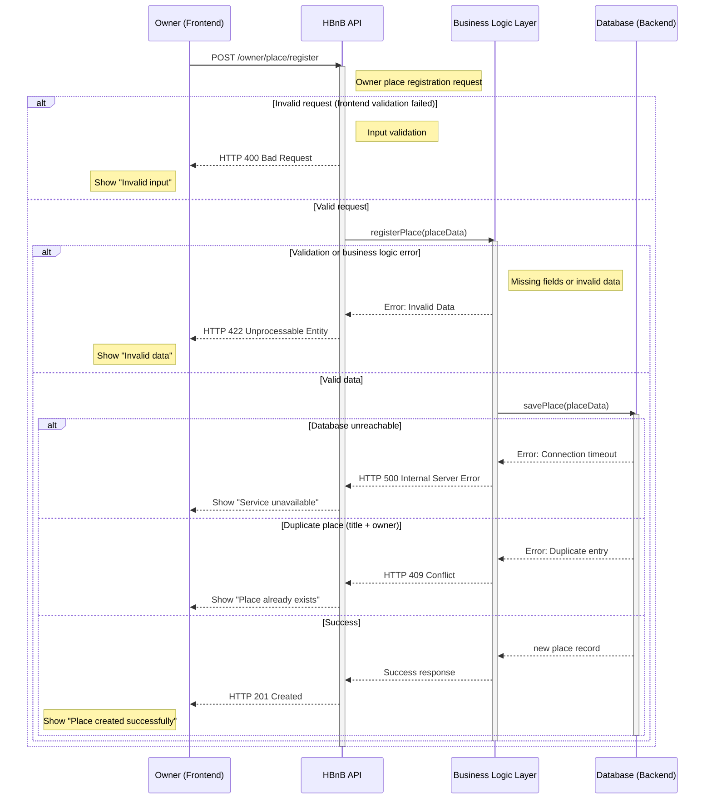
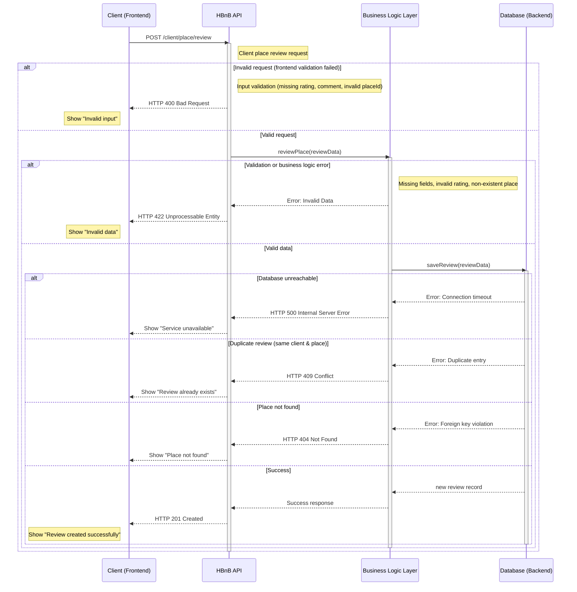
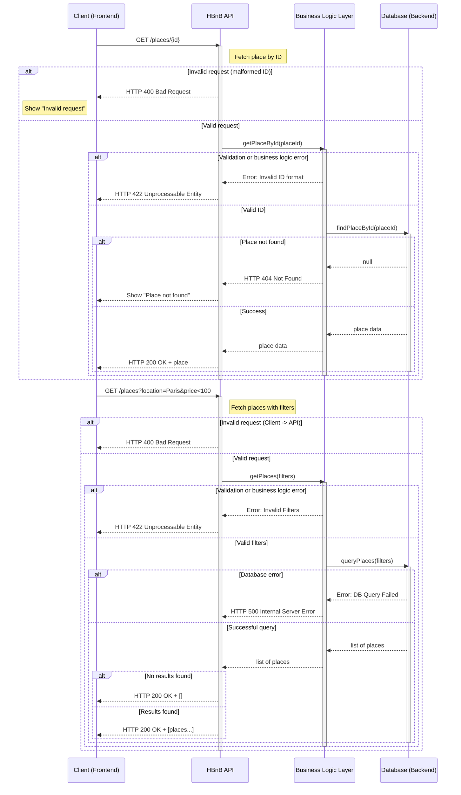

# Sequence Diagrams for API Calls

# 1 - User Registration
## A user signs up for a new account.

# 2 - Place Creation
## A user creates a new place listing.

# 3 - Review Submission
## A user submits a review for a place

# 4 - Fetching a list of places
## A user requests a list of places based on certain criteria.

