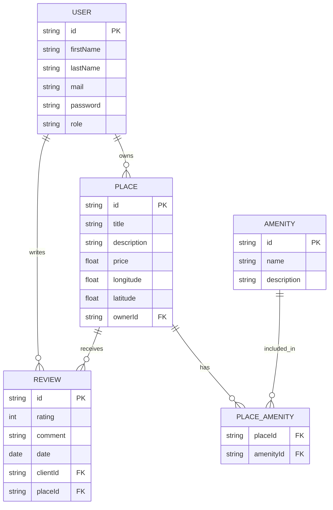

## 📌 Database Model Overview

This database represents an accommodation booking system with five main entities:

- **User**: Stores personal data and roles.
  - Can own places and write reviews.

- **Place**: Contains listing details (description, price, location).
  - Owned by a user, receives reviews, and includes amenities.

- **Amenity**: Represents features available in places (e.g., Wi-Fi, parking).
  - Linked to places through a many-to-many relationship.

- **Review**: Stores ratings and comments written by users about places.

- **Place_Amenity**: Join table linking places and amenities.

### Relationships
- One user → many places
- One user → many reviews
- One place → many reviews
- Many places ↔ many amenities

